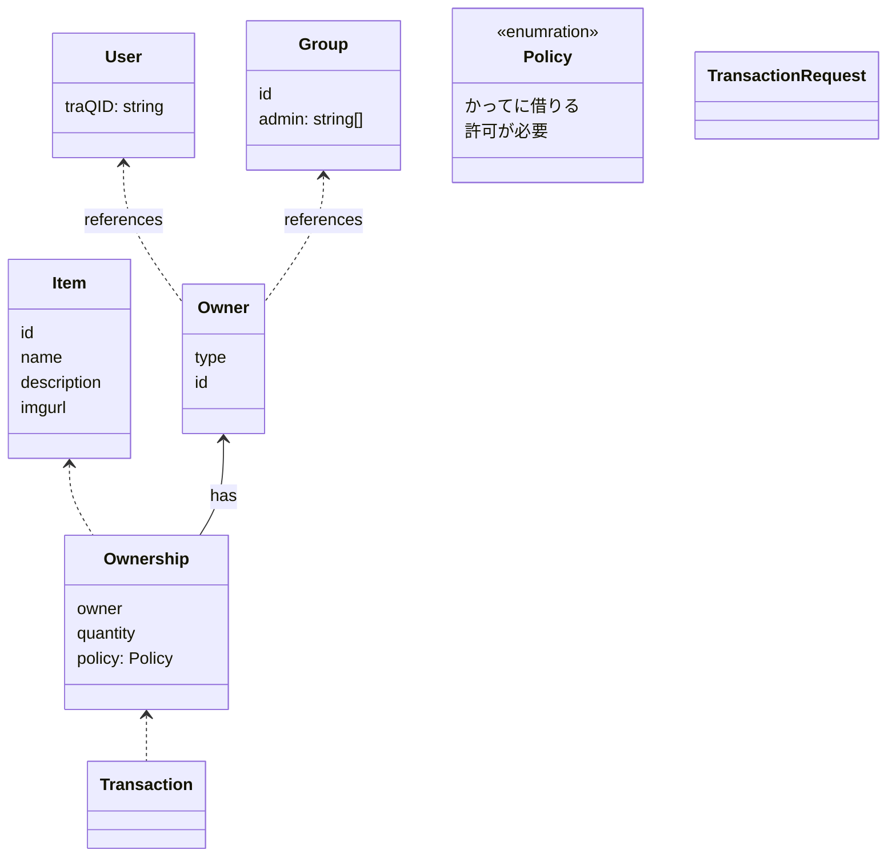

```mermaid
classDiagram

  class Item {
    id
    name 
    description
    imgurl
  }
  
  class Ownership {
    owner
    quantity
    policy: Policy
  }
  
  class Owner {
    type
    id
  }
  
  class User {
    traQID: string
  }
  
  class Group {
    id
    admin: string[]
  }
  
  class Policy {
    <<enumration>>
    かってに借りる
    許可が必要
  }
  
  class Transaction {
    
  }
  
  class TransactionRequest {
  
  }
  
  Item <.. Ownership
  Ownership <.. Transaction
  Owner <-- Ownership: has
  User <.. Owner: references
  Group <.. Owner: references
```