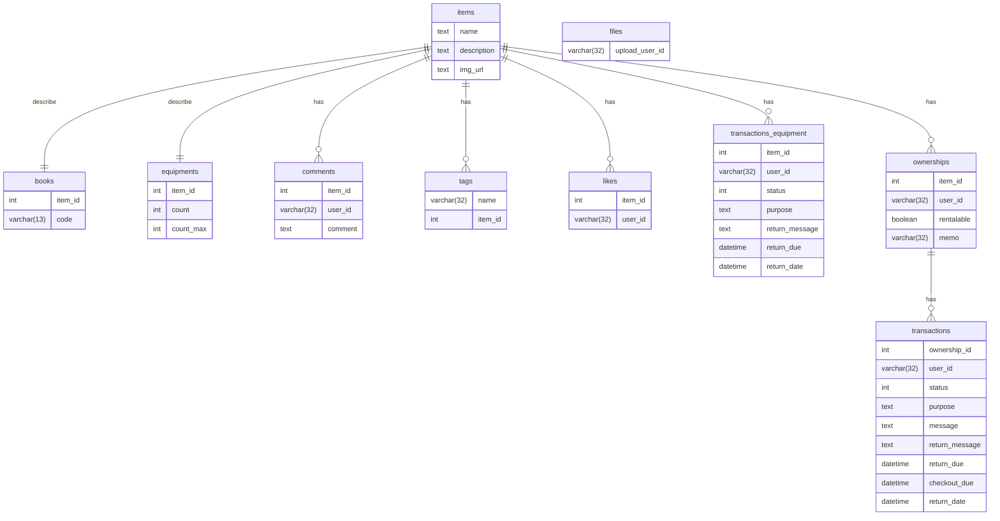

# DB schema

### items

| Name           | Type     | NULL | Key | Default | Extra | 説明            |
 |----------------|----------|------|-----|---------|-------|---------------|
| **id**         | int      | NO   | PRI |         |
| name           | text     | NO   |     |         |       | 物品名           |
| description    | text     |      |     |         |       | 物品の説明文        |
| img_url        | text     |      |     |         |       | 画像のURL(外部に頼る) |
| **created_at** | datetime | NO   |     |         |       |               |
| **updated_at** | datetime |      |     |         |       |               |
| **deleted_at** | datetime |      |     |         |       |               |

### books

| Name    | Type        | NULL | Key | Default | Extra | 説明      |
 |---------|-------------|------|-----|---------|-------|---------|
| item_id | int         | NO   | PRI |         |       |         |
| code    | varchar(13) |      |     |         |       | ISBNコード |

### equipments

| Name      | Type | NULL | Key | Default | Extra | 説明              |
 |-----------|------|------|-----|---------|-------|-----------------|
| item_id   | int  | NO   | PRI |         |       |                 |
| count     | int  | NO   |     |         |       | 借りられる物品の個数      |
| count_max | int  | NO   |     |         |       | 所有しているすべての物品の個数 |

### comments

| Name           | Type        | NULL | Key | Default | Extra | 説明 |
|----------------|-------------|------|-----|---------|-------|----|
| **id**         | int         | NO   | PRI |         |       |    |
| item_id        | int         | NO   |     |         |       |    |
| user_id        | varchar(32) | NO   |     |         |       |    |
| comment        | text        | NO   |     |         |       |    |
| **created_at** | datetime    | NO   |     |         |       |    |
| **updated_at** | datetime    |      |     |         |       |    |
| **deleted_at** | datetime    |      |     |         |       |    |

### files

ファイルは \<id\>.\<拡張子\> の形で保存される

| Name           | Type     | NULL | Key | Default | Extra | 説明 |
 |----------------|----------|------|-----|---------|-------|----|
| **id**         | int      | NO   | PRI |         |       |    |
| upload_user_id | int      | NO   |     |         |       |    |
| **created_at** | datetime | NO   |     |         |       |    |  
| **updated_at** | datetime |      |     |         |       |    |  
| **deleted_at** | datetime |      |     |         |       |    |  

### tags

| Name           | Type        | NULL | Key | Default | Extra | 説明 |
 |----------------|-------------|------|-----|---------|-------|----|
| **id**         | int         | NO   | PRI |         |       |    |
| name           | varchar(32) | NO   | UNI |         |       |    |
| item_id        | int         | NO   |     |         |       |    |
| **created_at** | datetime    | NO   |     |         |       |    |
| **updated_at** | datetime    |      |     |         |       |    |
| **deleted_at** | datetime    |      |     |         |       |    |

### likes

| Name           | Type        | NULL | Key | Default | Extra | 説明 |
 |----------------|-------------|------|-----|---------|-------|----|
| **id**         | int         | NO   | PRI |         |       |    |    
| item_id        | int         | NO   |     |         |       |    |    
| user_id        | varchar(32) | NO   |     |         |       |    | 
| **created_at** | datetime    | NO   |     |         |       |    | 
| **updated_at** | datetime    |      |     |         |       |    |      
| **deleted_at** | datetime    |      |     |         |       |    |      

### transactions

| Name           | Type        | NULL | Key | Default | Extra | 説明                                |
 |----------------|-------------|------|-----|---------|-------|-----------------------------------|
| **id**         | int         | NO   | PRI |         |       |                                   |
| ownership_id   | int         | NO   |     |         |       |                                   |
| user_id        | varchar(32) | NO   |     |         |       | アクションを起こす人                        |
| status         | int         | NO   |     |         |       | 0=リクエスト済み、1=貸し出し中、2=返却済み、3=貸し出し拒否 |
| purpose        | text        |      |     |         |       |                                   |
| message        | text        |      |     |         |       | 貸主からのメッセージ（2/14に部室に置きます！など）       |
| return_message | text        |      |     |         |       |                                   |
| return_due     | datetime    |      |     |         |       | 返却予定日                             |
| **created_at** | datetime    | NO   |     |         |       |                                   |
| **update_at**  | datetime    | NO   |     |         |       |                                   |
| checkout_date  | datetime    |      |     |         |       | ステータスが1になった日                      |
| return_date    | datetime    |      |     |         |       | ステータスが2または3になった日                  |

### transactions_equipment

| Name           | Type        | NULL | Key | Default | Extra | 説明                                |
 |----------------|-------------|------|-----|---------|-------|-----------------------------------|
| **id**         | int         | NO   | PRI |         |       |                                   |
| item_id        | int         | NO   |     |         |       |                                   |
| user_id        | varchar(32) | NO   |     |         |       | アクションを起こす人                        |
| status         | int         | NO   |     |         |       | 0=リクエスト済み、1=貸し出し中、2=返却済み、3=貸し出し拒否 |
| purpose        | text        |      |     |         |       |                                   |
| return_message | text        |      |     |         |       |                                   |
| return_due     | datetime    |      |     |         |       | 返却予定日                             |
| **created_at** | datetime    | NO   |     |         |       |                                   |
| **update_at**  | datetime    | NO   |     |         |       |                                   |
| checkout_date  | datetime    |      |     |         |       | ステータスが1になった日                      |
| return_date    | datetime    |      |     |         |       | ステータスが2または3になった日                  |

### ownerships

| Name           | Type        | NULL | Key | Default | Extra | 説明        |
 |----------------|-------------|------|-----|---------|-------|-----------|
| **id**         | int         | NO   | PRI |         |       |           |
| item_id        | int         | NO   |     |         |       |           |
| user_id        | varchar(32) | NO   |     |         |       |           |
| rentalable     | boolean     | NO   |     |         |       | 借りられるかどうか |
| memo           | varchar(32) |      |     |         |       |           |
| **created_at** | datetime    | NO   |     |         |       |           |
| **updated_at** | datetime    |      |     |         |       |           |
| **deleted_at** | datetime    |      |     |         |       |           |